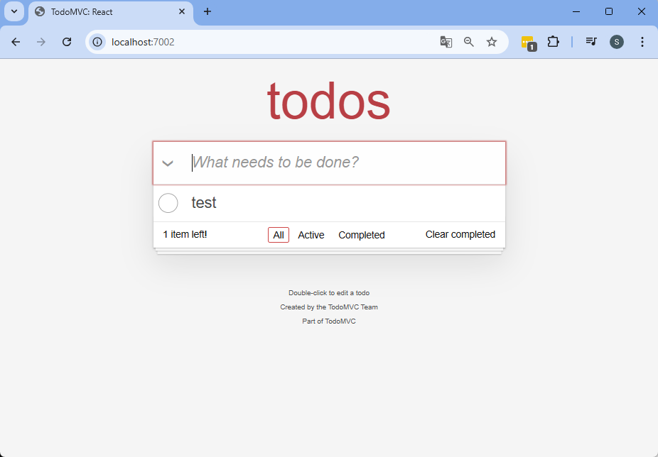

# Table of contents

- [1. Basic Docker Commands](#1-basic-docker-commands)
- [2. Creating Your First Docker Image](#2-creating-your-first-docker-image)
- [3. Running the TodoMVC application with Docker](#3-running-the-todomvc-application-with-docker)
- [4. Running the Playwright Tests with Docker](#4-running-the-playwright-tests-with-docker)
- [5. Coordinating Docker Containers with Docker Compose](#5-coordinating-docker-containers-with-docker-compose)
 
## 1. Basic Docker Commands

### 1. Check Docker Version
```bash
docker --version
```
Output:
```
Docker version 27.3.1, build ce12230
```
### 2. Run the Hello World Container
```bash
docker run hello-world
```
Output:
```
Hello from Docker!
This message shows that your installation appears to be working correctly.

To generate this message, Docker took the following steps:
 1. The Docker client contacted the Docker daemon.
 2. The Docker daemon pulled the "hello-world" image from the Docker Hub.
    (amd64)
 3. The Docker daemon created a new container from that image which runs the
    executable that produces the output you are currently reading.
 4. The Docker daemon streamed that output to the Docker client, which sent it
    to your terminal.

To try something more ambitious, you can run an Ubuntu container with:
 docker run -it ubuntu bash

Share images, automate workflows, and more with a free Docker ID:
 https://hub.docker.com/

For more examples and ideas, visit:
 https://docs.docker.com/get-started/
```
### 3. List Docker Images
This command lists all Docker images available locally on your system.  
Each image represents a snapshot that can be used to create containers
```bash
docker images
```
```
REPOSITORY                        TAG       IMAGE ID       CREATED         SIZE
hello-world                       latest    5b3cc85e16e3   20 months ago   24.4kB
```
### 4. Pull a Specific Docker Image Version
Downloads the specified image from Docker Hub.
```bash
docker pull nginx:1.24
```
### 5. Pull the Latest Docker Image
```bash
docker pull nginx:latest
```
## 2. Creating Your First Docker Image
### 1. Go to directory
```bash
cd docker-web-demo
```
### 2. Create a "Dockerfile"
```dockerfile
FROM nginx:latest
COPY index.html /usr/share/nginx/html/index.html
```
The Dockerfile:
   1. Uses ``nginx:latest`` as the base image, which comes with a pre-installed and configured ``Nginx server``.
   2. This line copies a local file called ``index.html`` (which must be in the same directory as the Dockerfile) to the container.
      The file is placed in the ``/usr/share/nginx/html/`` directory, which is the default location where ``Nginx`` looks for files to serve as web content.
    ```dockerfile
    COPY index.html /usr/share/nginx/html/index.html
    ```
### 3. Build the Docker Image  
```bash
docker build -t my-nginx-demo .
```
This command builds a Docker image from a Dockerfile located in the current directory (.).  

**docker build:** This is the command used to build a Docker image.  

**-t my-nginx-demo**: The **-t** flag tags the image with a name (**my-nginx-demo**).    

**.**: The period represents the current directory, where **Docker** _**will look for the Dockerfile**_ to build the image.  

### 4. Run the Docker Container
```bash
docker run -d -p 8080:80 --name web-demo my-nginx-demo
```
This command runs a Docker container based on the my-nginx-demo image with several specified options.  
**docker run**: This is the command to ``run a Docker container`` from ``an image``.    

**-d**: Detached mode (**runs the container in the background**).  

**-p 8080:80**: **Maps port 8080 on your local machine** to port 80 inside the container.    

**--name web-demo**: Assigns the name ``web-demo`` to the container.  

**my-nginx-demo**: Specifies the ``image`` to use for the container.  

### 5. Access the Web Page in Your Browser
Open your web browser and visit:  
```bash
http://localhost:8080/
```
Visiting http://localhost:8080/ will display the custom web page being served by the ``Nginx container``, based on the ``index.html`` file **you added to the image**.

### 6.Stop a Running Docker Container
```bash
docker stop web-demo
```
This command is used to stop a running Docker container.  
**docker stop**: This is the command to ``stop a running container``.  
**web-demo**: The ``name of the container to stop``. In this case, it refers to the container that was started with the name web-demo.

### 7. List Running Docker Containers
```bash
docker ps
```
This command shows a list of all currently running ``Docker containers``.
**docker ps**: Lists the running containers on your system. By default, it **only shows containers that are actively running**.
### 8. Remove a Stopped Docker Container
```bash
docker rm web-demo
```
This command removes a stopped Docker container from your system.    
**docker rm**: This command removes one or more containers from your system.  
**web-demo**: The **name of the container to remove**, in this case, the ``web-demo container``.  
  <div align="right">
      <b><a href="#table-of-contents">↥ Back to top</a></b>
  </div>

## 3. Running the TodoMVC application with Docker
### 1. Go to directory
```bash
cd ../react-todomvc
```

### 2. Create a "Dockerfile"
```dockerfile
# Uses the official Node.js image, version 16, as the base image.
FROM node:16

# Creates and sets "/app" as the directory where all subsequent commands will be executed.
WORKDIR /app

# Copies the package.json and package-lock.json files from the host machine to the current directory (./) in the container.
COPY package*.json ./

# Prepares the application environment by installing all necessary libraries and dependencies.
RUN npm install

# Copies all files and folders from the 'host machine's current' directory to the 'container's current directory' (/app).
COPY . .

# Declares that the container will use port 7002.
EXPOSE 7002

# Launches the application. This assumes the serve script is defined in the package.json file and typically starts the application server
CMD ["npm", "run", "serve"]
```
### 3. Build a Docker Image
Creates an image named ``todomvc-app``, which can be used to run containers.
```bash
docker build -t todomvc-app .
```
### 4. Run a Container with the Application
This command starts a container based on the ``todomvc-app`` image and maps port ``7002`` from the container to port 7002 **on the host machine**.  
```bash
docker run -p 7002:7002 todomvc-app
```
### 5. Access the Web Page in Your Browser
Open your web browser and visit:
```bash
http://localhost:7002/
```
Visiting http://localhost:7002/ will display the custom web page being served by the ``Nginx container``, based on the ``index.html`` file **you added to the image**.


### 6. Execute Tests Locally for the todomvc-acceptance-tests Project
1. **Navigate to the Project Directory:**
Ensure you're in the root directory of the ``todomvc-acceptance-tests`` project.
2. **Execute the Tests:**  
```bash
gradle clean test
``` 


<div align="right">
   <b><a href="#table-of-contents">↥ Back to top</a></b>
</div>

## 4. Running the Playwright Tests with Docker
### 1. Go to directory(``todomvc-acceptance-tests``)
```bash
cd ..
```

### 2. Create a "Dockerfile"
```dockerfile
# Use OpenJDK 23 slim as the base image
FROM openjdk:23-slim

# Set the working directory inside the container
WORKDIR /app

# Install dependencies required for Playwright
RUN apt-get update && apt-get install -y \
    wget \
    curl \
    gnupg \
    ca-certificates \
    unzip \
    && apt-get clean

# Install Node.js and npm, playwright and compatible browsers
RUN mkdir -p /usr/local/playwright && \
    curl -fsSL https://deb.nodesource.com/setup_18.x | bash - && \
    apt-get install -y nodejs && \
    npm install -g playwright && \
    npx playwright install && \
    npx playwright install-deps

# Copy project files (assuming the Dockerfile is in the same directory as the project)
COPY . .

# Build the project using Gradle (skip tests during build)
RUN ./gradlew clean build -x test

# Command to run the test cases using JUnit5
CMD ["./gradlew", "clean", "test", "--rerun-tasks"]
```
### 3. Build a Docker Image for Playwright Tests
Creates a Docker image named ``playwright-tests`` containing all the dependencies, tools, and project files necessary to run Playwright tests.
```bash
docker build -t playwright-tests .
```
### 4. Run Playwright Tests in a Docker Container
This command runs **a container** from the ``playwright-tests image`` and connects it to the ``host network`` for improved network access.
```bash
docker run --network host playwright-tests
```

**Note:**
Before running the tests, ensure that the application (**todomvc-app**) is ``running locally`` so the Playwright tests can interact with it. You can start the application using the following command:  
```bash
docker run -p 7002:7002 todomvc-app
```
  <div align="right">
      <b><a href="#table-of-contents">↥ Back to top</a></b>
  </div>

## 5. Coordinating Docker Containers with Docker Compose
### 0. Configuring the docker-compose.yml File
The ``docker-compose.yml`` file defines **the services** and **their interactions**.  
```dockerfile
services:
  webapp:
    build:
      context: ./react-todomvc  # Specifies the directory containing the Dockerfile for building the webapp service.
    ports:
      - "7002:7002"  # Maps port 7002 of the container to port 7002 on the host.
    networks:
      - test-network  # Attaches the service to a custom Docker network named "test-network".
    healthcheck:
      test: [ "CMD", "curl", "-f", "http://localhost:7002" ]  # Runs a health check by sending a request to localhost:7002.
      interval: 10s  # Specifies the interval between health checks.
      timeout: 5s  # Sets the timeout for the health check command.
      retries: 5  # The container is marked unhealthy after 5 failed checks.
    restart: "no"  # Prevents the container from restarting automatically.

  tests:
    build:
      context: .  # Specifies the current directory as the build context for the tests service.
    depends_on:
      webapp:
        condition: service_healthy  # Ensures the tests service starts only when the webapp service is healthy.
    networks:
      - test-network  # Attaches the service to the same "test-network" as the webapp for communication.
    volumes:
      - ./target:/app/target  # Maps the local "target" directory to "/app/target" in the container.
    environment:
      - APP_HOST_URL=http://webapp:7002  # Sets the URL of the webapp service for the tests.
    user: "${UID}:${GID}"  # Runs the container with the host's user and group IDs.
    restart: "no"  # Prevents the container from restarting automatically.

networks:
  test-network:
    driver: bridge  # Defines a custom bridge network for inter-service communication.
```
### 1. Building the Container Images
```bash
docker-compose build
```
This command builds the **Docker images** for **the services** defined in the ``docker-compose.yml`` file.   
Specifically:   

**webapp**: The image is built from the context ``./react-todomvc``, which likely contains a ``React project`` configured to **run on port 7002**.    

**tests**: The image is built from the current directory ``.``, which likely contains **the environment** and **scripts for running automated tests**.  

### 2. Starting Services and Running Tests
This step involves **starting the services** defined in the `docker-compose.yml` file, **coordinating their dependencies, and executing automated tests**.  
The command to use is:  
```bash
docker-compose up --exit-code-from tests
```

Here's what happens:  
**`webapp` service**:
  * Exposes `port 7002` to **the host machine**.
  * Includes a `healthcheck`, which sends a `curl` request to http://localhost:7002 to verify that the service is running correctly.
  * The `tests` service will not start until the `webapp` is healthy, as defined by the `depends_on` condition.

**`tests` service:**
  * Depends on the `webapp` service and will only start when the `webapp` healthcheck passes.
  * Likely executes tests against the webapp service using the environment variable `APP_HOST_URL=http://webapp:7002`.    

**Returns an `exit code` based on the result of the tests:**
  * A `non-zero exit code` indicates **test failures**.
  * A `zero exit code` indicates all tests passed successfully.  

This command ensures that services are started in the correct order, tests are executed, and the overall process concludes with a status code reflecting the test results.


### 3. Exporting Test Reports
After running the tests, you can find the reports locally in the `./target` directory. These reports are useful for manual review or integration with tools that analyze test results.  

The tests service uses the following volume configuration:
```dockerfile
volumes:
  - ./target:/app/target
```
This means any files written to `/app/target` inside the tests container are synchronized with the `./target` directory **on the host machine**.  
<div align="right">
   <b><a href="#table-of-contents">↥ Back to top</a></b>
</div>